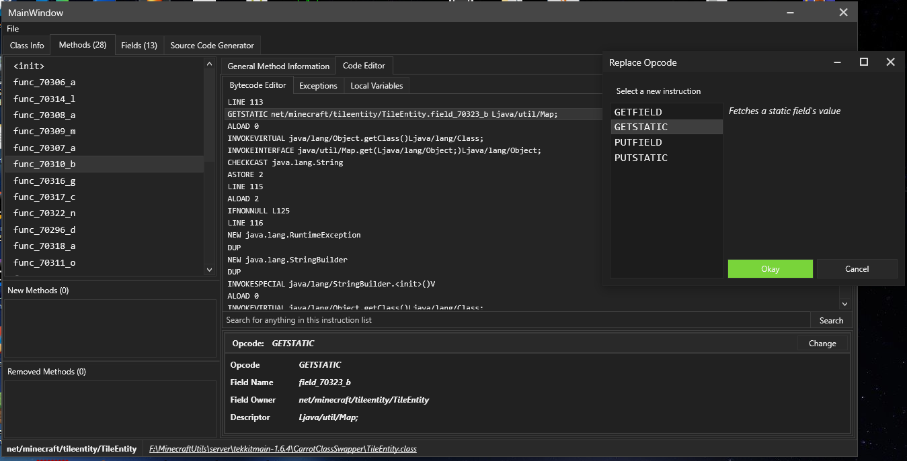

# BCEdit180
A java classfile viewer and editor, written in C#. 

Similar to jclasslib but will soon support many more features, e.g copy and pasting bytecode, adding and removing methods and fields, etc

## Preview

