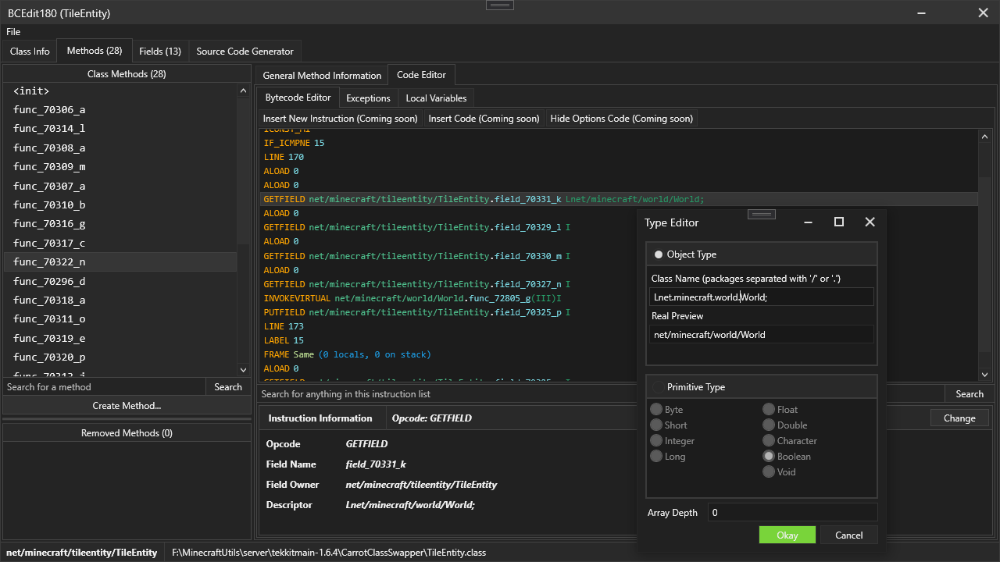
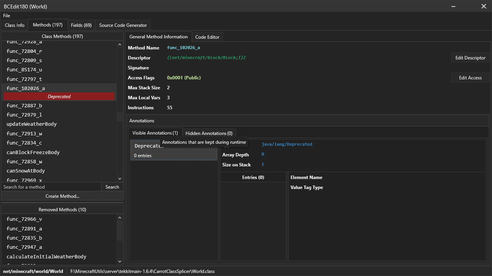

# BCEdit180
A java classfile viewer and editor, written in C#. 

Similar to jclasslib but will soon support many more features, e.g copy and pasting bytecode, adding and removing methods and fields, etc

See the bottom of this page for a feature list... and also some bugs :(

## Preview
### Bytecode editor

### Method general info

# Installing
You can download the release.zip file from releases, which includes the .exe with all the dependencies

If you want to build this though, you will need to build my custom fork of java-asm: https://github.com/AngryCarrot789/java-asm

You will also need to build the projects REghZy.MVVM and REghZy.WPF from https://github.com/AngryCarrot789/REghZyUtilsCS

That leaves you with 3 DLL files you need to reference in this project. Once you reference them, you should be able to build

My fork of java-asm targets .NET Standard 2.0, as well as my MVVM and WPF libraries, which works fine with .NET Framework 4.7.2 which this project uses (i think... i didn't really look)

# Features
- Class info viewer
- Interfaces list (editable, currently can't add/remove)
- Editable class attributes (apart from bootstrap methods; they are contained in the method instructions)
- Method list, + general method info editor (descriptor, name, max stack/locals, etc)
- Method instruction editor (in bytecode form) which is (hopefully) fully functional, allowing almost everything to be modified (apart from labels). The bytecode editor also has colours, which helps the details stand out
- Exception table and local variable table editor. Cannot add/remove exceptions or local variables currently (coming soon)
- Field list + general field info editor (name, descriptor, signature, etc)
- A source code generator (does not actually generate method source code, only the structure of the class (all methods will look 'abstract'))
- You can create and remove methods too. But you can't actually add instructions to the methods yet, so it's pretty much pointless
- You can view annotations, but you can only edit the annotation type, and the name/type of the annotation's entries. Will add more to this soon though

There's probably more that i've missed, but this is generally what this program can do
