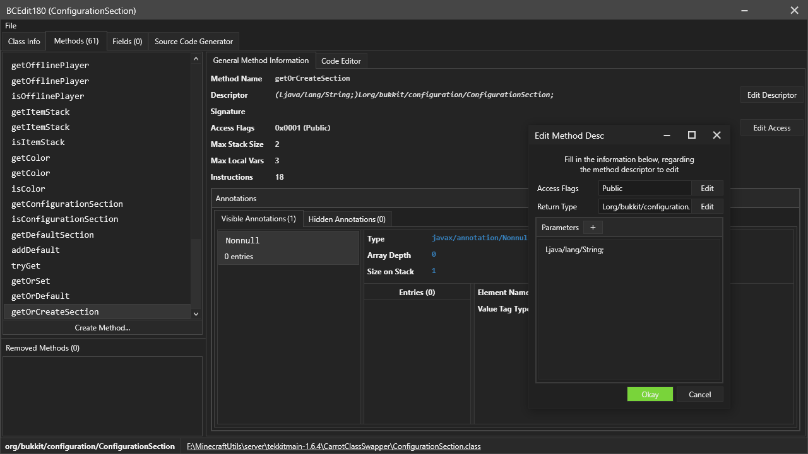

# BCEdit180
A java classfile viewer and editor, written in C#. 

Similar to jclasslib but will soon support many more features, e.g copy and pasting bytecode, adding and removing methods and fields, etc

# Features
- Class info viewer
- Interfaces list (editable, currently can't add/remove)
- Editable class attributes (apart from bootstrap methods; they are contained in the method instructions)
- Method list, + general method info editor (descriptor, name, max stack/locals, etc)
- Method instruction editor (in bytecode form; currently only field, method, dynamicinvoke and LDC instructions are readily supported for modification, you can edit the opcode of almost any instruction though, but keep in mind to manually modify the stack size)
- Exception table and local variable table editor. Cannot add/remove exceptions or local variables currently (coming soon)
- Field list + general field info editor (name, descriptor, signature, etc)
- A source code generator (does not actually generate method source code, only the structure of the class (all methods will look 'abstract'))
- You can create and remove methods too. But you can't actually add instructions to the methods yet, so it's pretty much pointless
- You can view annotations, but you can only edit the annotation type, and the name/type of the annotation's entries. Will add more to this soon though

There's probably more that i've missed, but this is generally what this program can do

## Preview

