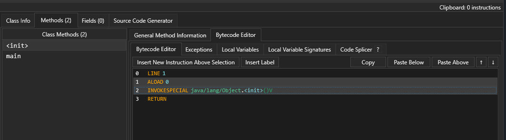

# BCEdit180
A java classfile viewer and editor, written in C#. 

Similar to jclasslib but will soon support many more features, e.g copy and pasting bytecode, adding and removing methods and fields, etc

[Click here](#installing) for downloading/building

[Click here](#features) for a feature list

[Click here](#copying-code-between-methods) for insertion/removal and also copying instructions between methods/classes

## Preview
### Bytecode editor

### Class info

# Installing
You can download the release.zip file from releases, which includes the .exe with all the dependencies

If you want to build it yourself, you will need to build the projects REghZy.MVVM and REghZy.WPF from https://github.com/AngryCarrot789/REghZyUtilsCS,
and reference those 2 DLL files in this project. Once you reference them, you should be able to build

You don't need to download my fork of the JavaAsm library, as i moved it into this solution. But it can be found here: https://github.com/AngryCarrot789/java-asm
My fork of java-asm targets .NET Standard 2.0 (instead of 2.1 which the original creator used), as well as my MVVM and WPF libraries, which works fine with .NET Framework 4.7.2 which this project uses (i think... i didn't really look)

# Features 
- Class info viewer
- Interfaces list (can edit, add and remove interfaces)
- Editable class attributes (apart from bootstrap methods; they are contained in the method instructions)
- Method list, + general method info editor (descriptor, name, max stack/locals, etc)
- Method instruction editor (bytecode editor), allowing basically every single instruction to be modified. The bytecode editor also has colours, which helps the details stand out.
- You can copy instructions between methods (including methods in different classes), using the copy and paste buttons 
- Exception table and local variable table editor. Cannot add/remove exceptions or local variables currently (coming soon)
- Field list + general field info editor (name, descriptor, signature, etc)
- A source code generator (does not actually generate method source code, only the structure of the class (all methods will look 'abstract'))
- You can create and remove methods too. But you can't actually add instructions to the methods yet, so it's pretty much pointless
- You can create and remove fields, which might have some use with reflection or when using custom ASM libraries
- You can view annotations, but you can only edit the annotation type, and the name/type of the annotation's entries. Will add more to this soon though

There's probably more that i've missed, but this is generally what this program can do

## Slight lag issues
When loading big class files (with 100s of methods), it may lag for a split second. The bytecode editor will be the most laggiest (scrolling isn't laggy at all); when you select a new method, it has to clear a list of instructions and create new list items for each instruction. WPF controls, like ListBoxItems (which the bytecode editor use for every instruction) usually takes about half a millisecond (0.5ms~) to create and add to the bytecode editor list. Meaning when you select a method with, say, 1000 instructions, there will be a half second lag spike. This is a limit in the WPF framework and i'm 99% certain there's no way to decrease this lag :( (unless i switch to a text editor... but i don't work at JetBrains so :<   )

# Copying code between methods
I use this feature a lot to inject instructions into an existing method (because i do a lot of minecraft plugin/mod fixes). So instead of decompiling, editing, and recompiling a class (which might not be successful if you're missing libraries, or if the decompilation isn't 100%), you can insert the instructions yourself.
But if you don't fancy inserting instructions 1-by-1:
- You can write a simple class in VSCode for example, then compile it (`javac MyClass.java` in CMD/terminal)
- Drag and drop the class you want to modify, and MyClass (or whatever you called it) into the app
- Then, in MyClass, goto Methods > Bytecode Editor and select the instructions you want to copy, then click Copy.
- Then goto the target class and into it's bytecode editor, and click either Paste Below or Paste Above (the selected instruction). Branches will keep their target, but you have to re-link branches if you copied a jump instruction or switch table/lookup but not it's target

The screenshots above probably don't show the copy/paste buttons, i have yet to update them:

